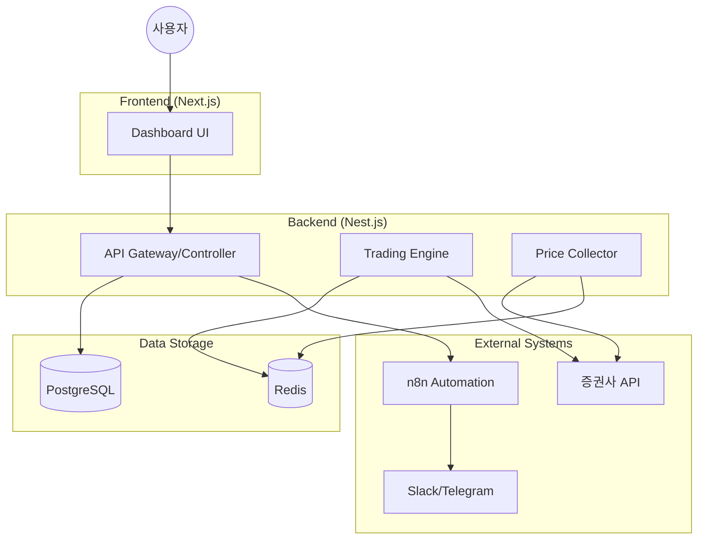

# 시스템 아키텍처 및 설계 명세서

## 1. 시스템 개요
- **시스템 구성 목적:** 실시간 금융 데이터 수집, 사용자 정의 전략 기반의 자동 매매 수행, 그리고 직관적인 자산 모니터링 대시보드 제공.
- **전체 시스템 컨텍스트:** 사용자가 웹 인터페이스를 통해 전략을 관리하고, 백엔드 엔진이 증권사 API와 통신하며 매매를 수행하는 클라이언트-서버 구조. n8n을 활용하여 외부 알림 및 주기적 리포트 업무를 분리하여 처리함.

## 2. 기술 스택 (Tech Stack)
- **프론트엔드:** Next.js (App Router), Tailwind CSS, Shadcn/UI, Chart.js (자산 시각화)
- **백엔드 / 프레임워크:** Nest.js (고정밀 트랜잭션 및 모듈화), Node.js
- **데이터베이스 & 캐시:**
    - **Main DB:** PostgreSQL (관계형 데이터 및 매매 이력 관리)
    - **Cache/Queue:** Redis (실시간 시세 캐싱 및 매매 요청 큐 관리)
- **인프라 및 가상화/컨테이너 환경:** Docker, Docker Compose, Linux (Ubuntu)
- **자동화 및 연동:** n8n (알림 워크플로우 및 데이터 정기 백업)

## 3. 시스템 아키텍처 (Architecture Diagram)

- **네트워크 및 보안 아키텍처 흐름:**
    - 모든 API 통신은 HTTPS/WSS 프로토콜을 사용함.
    - 증권사 API Key 및 민감한 설정값은 `Vault` 또는 암호화된 환경변수로 관리됨.
    - DB 및 백엔드 엔진은 외부 노출 없이 내부 컨테이너 네트워크에서만 통신함.

## 4. 데이터베이스 설계 (DB Design)
- **핵심 ERD 요약:**
    - **Users:** 사용자 정보 및 인증 관련 데이터.
    - **Accounts:** 증권사 계좌 정보, API Key (암호화), 현재 잔고.
    - **Assets:** 현재 보유 종목, 평균 단가, 보유 수량.
    - **TradeHistory:** 매매 일시, 종목명, 매매가, 수수료, 체결 여부.
    - **Strategies:** 자동 매매 로직 파라미터 (RSI 값, 이동평균선 설정 등).

- **주요 테이블 명세 (예시):**
| Table | Description | Key Fields |
| :--- | :--- | :--- |
| `trade_logs` | 매매 수행 이력 | `id`, `account_id`, `symbol`, `side(BUY/SELL)`, `price`, `quantity`, `status`, `created_at` |
| `asset_snapshots` | 자산 변동 추이 기록 | `id`, `user_id`, `total_value`, `cash_balance`, `recorded_at` |

## 5. API 스펙 (API Specifications)
- **통신 규약:** REST API (일반 데이터), WebSocket (실시간 시세 스트리밍)
- **주요 엔드포인트 명세:**
    - `POST /auth/login`: 사용자 인증 및 JWT 발급.
    - `GET /assets/summary`: 전체 자산 보유 현황 및 수익률 조회.
    - `POST /trades/order`: 수동 매매 주문 요청.
    - `PATCH /strategies/:id`: 자동 매매 전략 파라미터 수정 및 활성화/비활성화.
    - `GET /history/trades`: 과거 매매 내역 필터링 검색.

## 6. 인프라 및 인시던트 모니터링 (Observability)
- **로깅 및 모니터링 구축 방안:**
    - **Application Logging:** Winston 라이브러리를 사용하여 로그 레벨별(Error, Info, Debug) 기록 및 파일 저장.
    - **Health Check:** Nest.js Terminus를 사용하여 API 및 DB 상태 실시간 체크.
    - **Alerting:** 매매 엔진 에러 또는 API 호출 실패 발생 시 n8n 워크플로우를 트리거하여 즉각적인 Telegram 알림 발송.
    - **Performance:** Docker stats 및 Node.js 프로세스 모니터링(PM2 또는 단순 로그)을 통해 자원 사용량 감시.